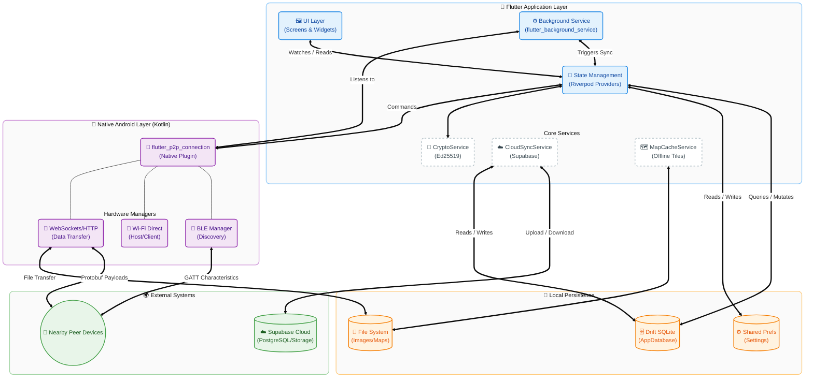
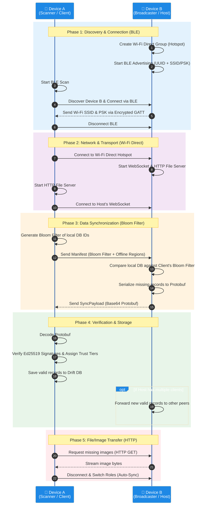
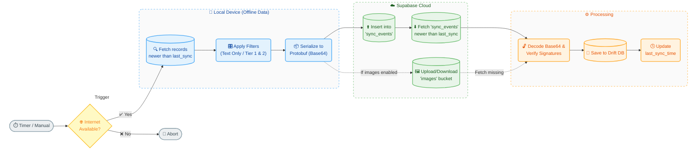
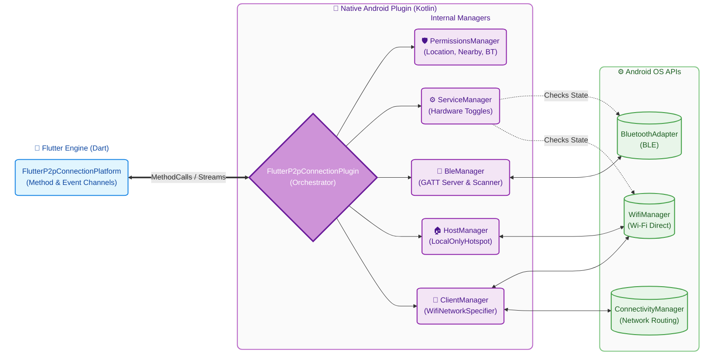
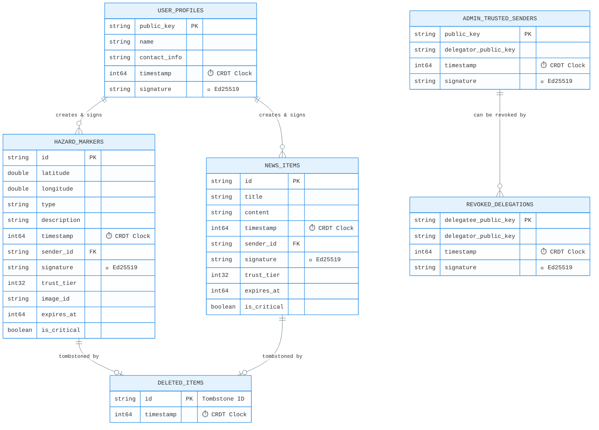

# Floodio (Temporary Name)

An Android application that is essentially an offline resilient disaster information hub that centralizes critical crisis information such as emergency news, evacuation areas, and hazard markers, and then conveys this information through an battery friendly and efficient, "store and forward" network. In times of network failure, users who are temporarily able to access the internet will function as "mules" to send information to other users who are currently offline through device syncing (per 5 minutes or manual) via automatic Bluetooth Low Energy and Wi-Fi Direct (News, areas, markers, offline maps, images, files) when they encounter each other. In order to stop false information from being disseminated during network failures, this application will utilize a "four-tier trust model" to filter users into Official, Admin-Trusted, Personally-Trusted, and Crowdsourced categories to prioritize verified information over unverified information.

**Note on P2P Syncing:** The terms "Host" and "Client" in the app only refer to how the Wi-Fi Direct connection is established. Once connected, data synchronization is fully **bidirectional**—both devices share and receive missing reports, maps, and files equally.

**Note on Local vs Global Actions:** 
*   **Global Actions:** Creating reports, resolving hazards, debunking, and promoting users to "Official Volunteer" (Tier 2) are **global** actions. They will propagate to all other devices in the mesh network during sync.
*   **Local Actions:** "Trusting" a sender (Tier 3), "Blocking" a sender, and "Clearing All Data" in settings are **local** actions. They only affect your personal device and will not alter the data on other users' devices.

## User Guide & Functional Flow
### 1. The Trust Model
*   **Tier 1 (Blue):** Verified government/NGO sources.
*   **Tier 2 (Purple):** Vetted volunteers. They can "Verify" Tier 4 reports to upgrade them.
*   **Tier 3 (Green):** People *you* personally trust.
*   **Tier 4 (Grey):** General public. Use with caution until verified.

### 2. Mesh Syncing
To sync with a peer:
1.  Both users tap the **Mesh Status Chip** (top right).
2.  Toggle **Mesh Auto-Sync** to ON.
3.  Keep devices within Bluetooth range. The app will automatically negotiate a Wi-Fi Direct connection, exchange database Bloom Filters, and transfer missing records/files.
4.  Once "Up to Date" appears, you can move apart; the data is now stored on both devices.

## How the Mesh Works
1.  **Discovery:** The app uses Bluetooth Low Energy (BLE) to advertise its presence and scan for nearby peers.
2.  **Connection:** Once a peer is found, the devices negotiate a Wi-Fi Direct connection (one acts as a temporary Hotspot).
3.  **Sync:** Devices exchange a "Bloom Filter" (a compact summary of their database). They then identify which reports, news, or map files the other is missing and transfer them.
4.  **Propagation:** As users move around, data "hops" from device to device, eventually covering the entire affected area without needing a single cell tower.

## 1. Prerequisites tools and libraries installed on your system:
*   **Flutter SDK** (Version 3.38.4 or higher, as specified in your `pubspec.yaml`).
*   **Protocol Buffers Compiler (`protoc`)**: This is used to compile your `.proto` files. 
    *   *Mac:* `brew install protobuf`
    *   *Linux:* `sudo apt install protobuf-compiler`
    *   *Windows:* Download from the [Protobuf GitHub releases](https://github.com/protocolbuffers/protobuf/releases) and add it to your PATH.
*   **A Physical Android Device**: Connected to your computer with **USB Debugging enabled**.

## 2. Install Dependencies
Open your terminal and navigate to the project directory and run:
```bash
flutter pub get
```

## 3. Generate / Regenerate Code (Protobuf, Riverpod, & Drift)
You must generate code for the local database (`drift`), state management (`riverpod`), and data models (`protobuf`) before running the app for the first time, **and whenever you modify `.proto` files or files annotated with `@riverpod` / `@DriftDatabase`**.

Since you have a `Makefile`, simply run:
```bash
make generate
```

*(If you are on Windows or don’t have `make` installed, run these three commands manually):*
```bash
mkdir -p lib/protos
protoc --dart_out=lib/protos -Iprotos protos/models.proto

# To build once:
dart run build_runner build --delete-conflicting-outputs

# Or to watch for changes continuously:
# dart run build_runner watch --delete-conflicting-outputs
```

## 4. Supabase Setup (Cloud Sync)
Floodio uses Supabase for its Cloud Gateway feature to sync mesh data with the cloud. To set this up:
1. Create a new project on [Supabase](https://supabase.com/).
2. Run the following SQL in the Supabase SQL Editor to create the required table:
   ```sql
   CREATE TABLE sync_events (
     id BIGINT GENERATED BY DEFAULT AS IDENTITY PRIMARY KEY,
     created_at TIMESTAMPTZ DEFAULT NOW(),
     payload_base64 TEXT NOT NULL
   );
   ```
3. Create a **public** storage bucket named `images`.
4. Get your Project URL and anon/publishable key from Dashboard Project Overview.

Create a `.env` file in the root of your project (make sure to add it to your `.gitignore`) and add your credentials:
```env
SUPABASE_URL=https://your-project-id.supabase.co
SUPABASE_ANON_KEY=sb_publishable_ZTXUvYLuY_c9UYKN8O_GwQ_gK_vU1yD
```
*Add these to your github repo secrets if you want to use release CI.*

## 5. Run the Application
Once the generated files are built and your device is listed in the connected devices, build and run the application:
```bash
flutter run --dart-define-from-file=.env
```
*(Or if you are using the Makefile, simply run `make run`)*

## Charts

*Note these would not render on README in GitHub mobile app. Only in web version of GitHub.*

### High-Level System Architecture



### P2P Mesh Synchronization Workflow


### 4-Tier Cryptographic Trust Strategy


### Cloud Gateway Sync Pipeline



### Native Android P2P Plugin Architecture



### Database Schema & LWW-CRDT Strategy

